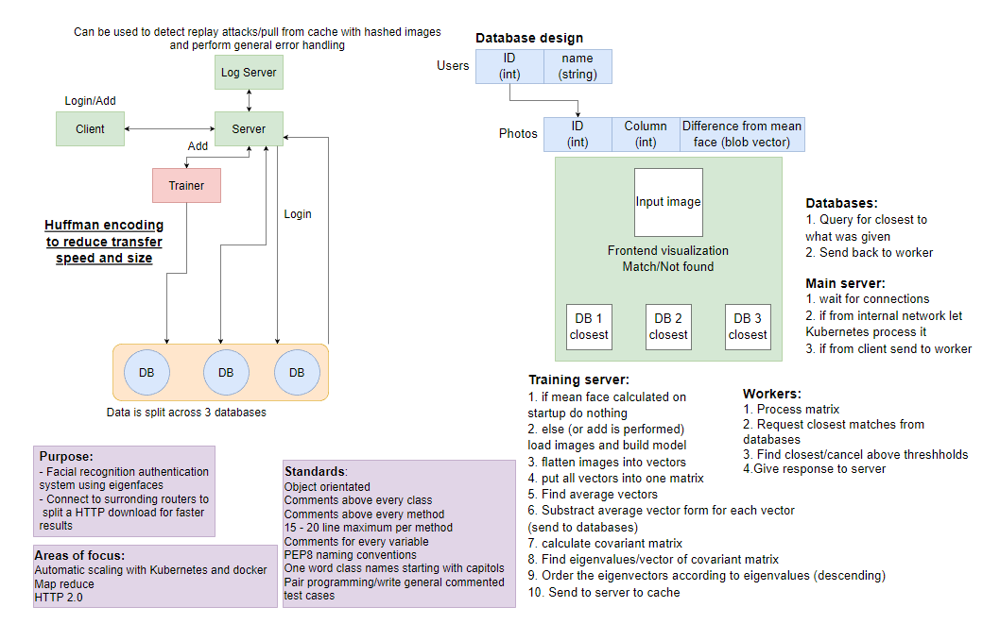

# MOB

## MOB is a authentication system that identifies existing users faces using the eigenface algorithm

 
 

### To run the system...
1. Launch docker
2. Create a virtual environment in the project directory
    - "python3 -m venv"
    - Navigate into the newly created .venv directory as far as the Scripts folder
    - Run "activate"
    - Return back to the project directory
3. Run setup.bat
4. navigate to the project directory then into src/presentation
    - Run "npm install"
    - Run "npm run build"
    - Run "npm run start"

 
 

## The team:
1. Dane Wanke
2. Tehillah Kangamba
3. Zeeshan Javed

