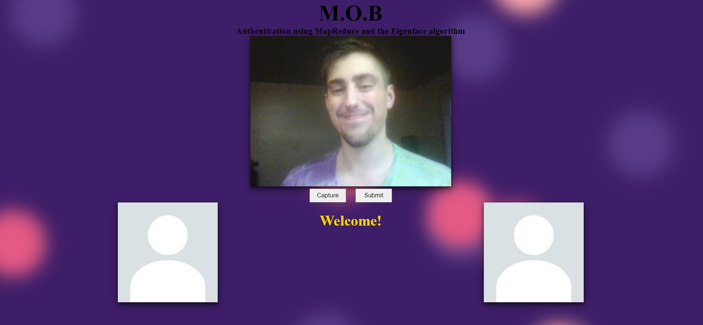

<div align=center>

# MOB
## MOB is *an authentication system* that identifies existing users faces using the eigenface algorithm

<br>
<br>

<div display=flexbox>



</div>
</div>

<br>
<br>

## Overview
- [Algorithms](#algorithms)
    - [MapReduce](#mapreduce)
    - [Eigenface](#eigenface)
- [Features]()
- [Launching MOB](#launching-mob)

<br>

## Algorithms
### MapReduce
MapReduce is a powerful algorithm designed to accelerate large-scale computations. It simplifies complex tasks into two main steps: mapping and reducing.

- **In the map phase**, the algorithm attempts to identify the most relevant information sort of like an initial data selection phase.

- **In the reduce phase**, this is where the algorithm perform the necessary computations. That is, it processes and computes results previously selected from the mapping phase.

### Eigenface
Eigenface algorithm is a facial recognition technique that reduces the complexity of facial images and extracts the most important features, called "eigenfaces." These eigenfaces are a set of orthogonal (uncorrelated) images that represent variations in facial features such as lighting, expressions, and poses.

1. **Data Collection**: Initially, a dataset of facial images is collected. Each image should have the same dimensions and should represent different individuals under varying conditions.

2. **PCA (Principal Component Analysis)**: Using PCA, the eigen face algorithm is able to reduce the dimensionality of the data to the most significant patterns in the dataset. These eigenfaces represent the directions in which the data varies the most.

3. **Feature Extraction**: Eigenfaces are used as features to represent each facial image. By projecting each facial image onto the eigenfaces, you can represent it as a set of coefficients that describe how much of each eigenface is present in the image.

4. **Recognition**: To recognize a new face, it is also projected onto the eigenfaces to obtain a similar set of coefficients. These coefficients are then compared with coefficients from known faces. The closest match indicates the identity of the person.

6. **Thresholding**: A threshold is applied to determine whether a new face is recognized as a known face or rejected as an unknown face. This threshold helps control the algorithm's sensitivity to variations.

<br>

## Features
- Detect replay attacks by logging already captured images
- Take a picture of yourself to send to M.O.B
- Upload images from your computer to send to M.O.B (if camera disabled)

<br>

<div align=center>
<b>When authentication is ran, the mean face is displayed as well as the image that came up as the best match and was subsquently retrieved from the database</b>
</div>

<br>

## Launching MOB
1. Launch docker
2. Create a virtual environment in the project directory and launch it
    - ```python -m venv ./.venv```
    - ```./.venv/Scripts/activate```
    - ```pip install -r ./deployment/requirements.txt```
3. Install dependencies and build frontend
    - ```cd src/presentation``` 
    - ```npm install```
    - ```npm run build```
    - ```cd ../../```
3. Run setup.bat from the project directory
    - ```setup.bat``` 
4. Connecting
    - Open up a browser and go to localhost:5000